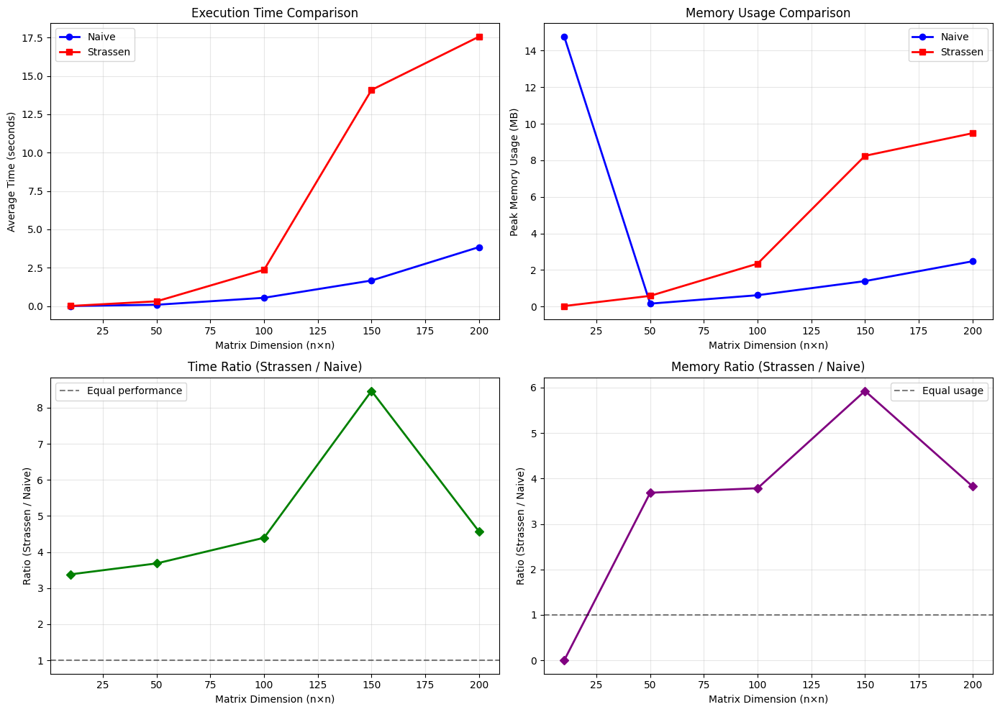
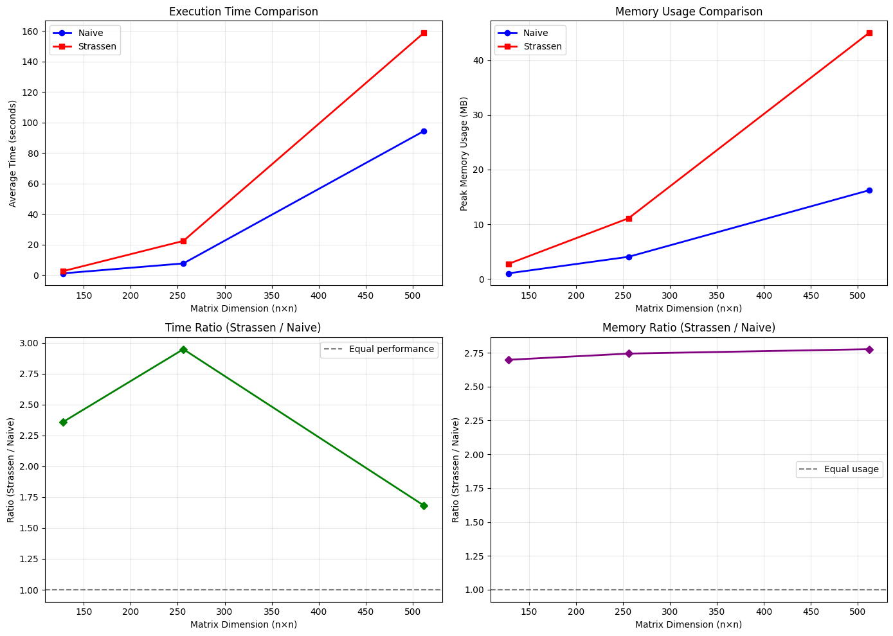
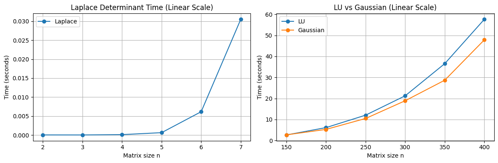
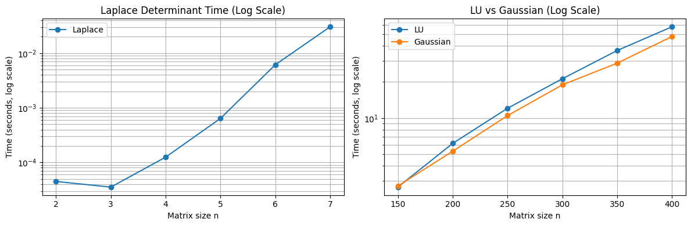
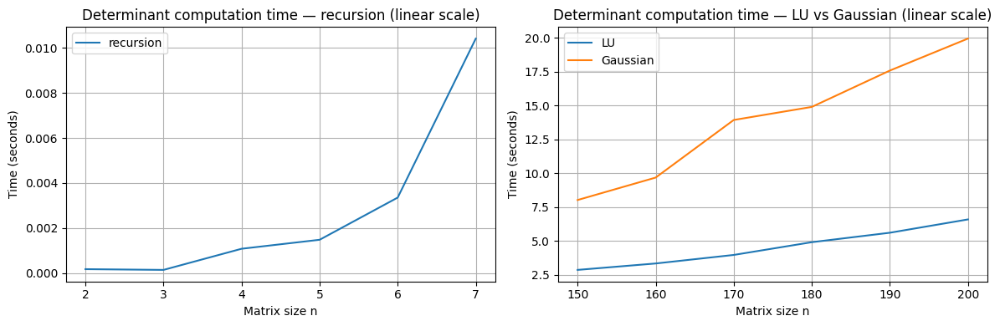
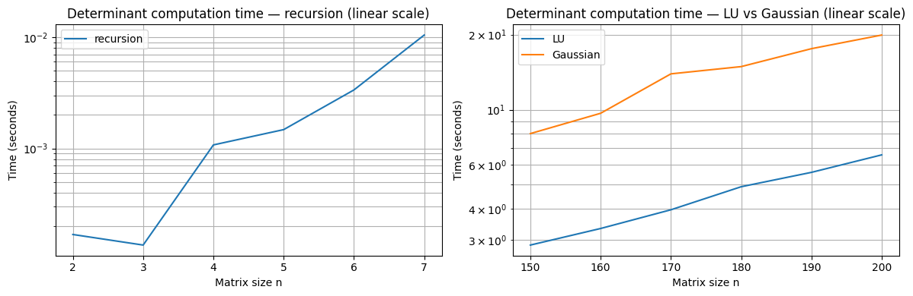

===========================
Project Report
===========================

:Author: Long Quang NGUYEN
:Course: Programming
:Student ID: 20255704

---------------------------
1. Introduction
---------------------------

The goal of this project is to design and implement a simplified version of NumPy in pure Python, called *MiniNumPy*, to understand 
how numerical computing and linear algebra libraries are built from scratch. Here there will be the implementation 
of core data structures, array operations, and linear algebra routines. 

-----------------------------------------------------
2. Project Description
-----------------------------------------------------

The detailed description of the project can be found here [#f1]_.

-----------------------------------------------------
3. Modules
-----------------------------------------------------

The project consist of two main modules, :class:`~mininumpy.array` 
and :class:`~mininumpy.minilinalg`. The :class:`~mininumpy.array` module consists of 
an :class:`~mininumpy.array.Array` class which act similar to ``numpy.ndarray`` but has 
only core functionalities. Same goes for :class:`~mininumpy.minilinalg`, which 
contains basic matrix/vector operations and factorizations/solvers.

^^^^^^^^^^^^^^^^^^^^^^^^^^^^^^^^^^^^^^^^^^^^^
3.1 Array
^^^^^^^^^^^^^^^^^^^^^^^^^^^^^^^^^^^^^^^^^^^^^

3.1.1 Data structure
""""""""""""""""""""""""""""""""""""""

The :class:`~mininumpy.array.Array` class should be able to works with any dimension matrix,
by doing so, it stores the data in flatten list (called ``_data``), row-major ordered, once
the entity is initialized. The main advantage of this is to improve readability and writeability 
of the code, without any impact on performance, since the :class:`~mininumpy.array.flatten` 
function has the same time and space complexity as to copying the nested list (original data). 

3.1.2 Matrix Operations
""""""""""""""""""""""""""""""""""""""

Based on the previous data structure, every matrix operations now have to deal with the flat
array given its original shape. To do this, we use a row-major indexing in the flat array to 
manipulate the elements easily without affecting the computational complexity.

Since the original data is now stored in a flat array, the :class:`~mininumpy.array.Array.shape` property only store the 
information of the original data and not the flattened, the reshape method will then only have to change the  
:class:`~mininumpy.array.Array.shape` property and will not affecting the actual flat list.

For :class:`~mininumpy.array.Array.transpose`, things stay the same since we have had access to each element using the indexing.

For matrix multiplication, :class:`~mininumpy.array.Array.__matmul__`, for naive way, this is unchanged, but for strassen matrix
multiplication, we transfer the current row-major indexing to the morton index before performing
strassen matrix multiplication.

For elementwise operations (or scalar) such as :class:`~mininumpy.array.Array.__add__`, :class:`~mininumpy.array.Array.__sub__`, 
:class:`~mininumpy.array.Array.__truediv__`, :class:`~mininumpy.array.Array.__mul__`, 
we just need to do 1 ``for`` loop and the job is done. 

^^^^^^^^^^^^^^^^^^^^^^^^^^^^^^^^^^^^^^^^^^^^^
3.2 Minilinalg
^^^^^^^^^^^^^^^^^^^^^^^^^^^^^^^^^^^^^^^^^^^^^

:class:`~mininumpy.minilinalg` contains different approaches for computing the
matrix inverse, determinant, and matrix multiplication. Its goal is to study the
complexity and runtime characteristics of these algorithms when executed purely
in Python, without any low-level optimizations. This makes it possible to
observe the direct impact of algorithm design on performance in a non-optimized
environment.

3.2.1 Determinant
"""""""""""""""""""""""""""""""""""""""

The determinant is implemented using three different algorithms, each with
distinct complexity and performance implications:

**Laplace Expansion**

- A recursive cofactor expansion method.  
- Complexity: :math:`O(n!)`, which grows extremely fast and becomes impractical
  for even moderately sized matrices.  
- Used mainly for educational purposes, as it illustrates the definition of the
  determinant but performs poorly in practice.

**LU Decomposition**

- Computes the determinant using the product of the diagonal elements of the
  :math:`U` matrix in an LU factorization.  
- Complexity: :math:`O(n^3)`.  
- Much faster than Laplace expansion and the most efficient among the
  pure-Python implementations.

**Gaussian Elimination**

- Performs row-reduction to upper triangular form and multiplies the diagonal
  entries to obtain the determinant.  
- Complexity: :math:`O(n^3)`.  
- Similar performance to LU decomposition, but typically simpler to implement.

3.2.2 Inverse
"""""""""""""""""""""""""""""""""""""""

Three inversion methods are implemented, reflecting different conceptual and
computational approaches:

**Recursive (Adjugate / Cofactor-based) Inverse**

- Uses the adjugate matrix and Laplace determinant to compute the inverse.  
- Complexity: dominated by repeated determinant computations, effectively
  :math:`O(n! * n)`.  
- Very slow in Python; provided for completeness and conceptual clarity.

**LU-based Inverse**

- Solves :math:`A x = e_i` for each column of the inverse using LU
  decomposition.  
- Complexity: :math:`O(n^3)`.  
- Typically the fastest and most numerically stable approach among the
  pure-Python implementations.

**Gaussian Elimination**

- Augments the matrix with an identity matrix and performs row-reduction until
  the left side becomes the identity.  
- Complexity: :math:`O(n^3)`.  
- Straightforward to implement and often competitive with LU-based inversion.

3.2.3 Matrix Multiplication
"""""""""""""""""""""""""""""""""""""""

Two matrix multiplication algorithms are included:

**Naive (Triple Loop) Multiplication**

- The standard textbook algorithm using three nested loops.  
- Complexity: :math:`O(n^3)`.  
- Easy to understand and implement, but relatively slow for large matrices in
  pure Python.

**Strassen's Algorithm**

- A divide-and-conquer algorithm that reduces the number of multiplications,
  achieving complexity :math:`O(n^{\log_2 7}) \approx O(n^{2.81})`.  
- Faster in theory, but in raw Python the overhead of recursion, slicing, and
  additional additions often cancels out the theoretical benefits.  
- Included to analyze how algorithmic improvements behave when no low-level
  optimizations exist.

-----------------------------------------------------
4. Benchmark Setup
-----------------------------------------------------

Each benchmark was run **three times** using all square 2D matrices, and the reported 
values represent the **average execution time** of the three measurements. All algorithms were
implemented purely in Python, without NumPy or any optimized C-backed numerical
libraries. This environment isolates the effect of algorithmic complexity on
runtime when operating in an unoptimized Python interpreter.

^^^^^^^^^^^^^^^^^^^^^^^^^^^^^^^^^^^^^^^^^^^^^
4.1 Benchmark Environment
^^^^^^^^^^^^^^^^^^^^^^^^^^^^^^^^^^^^^^^^^^^^^

All benchmarks were executed on a Windows 11 machine with the following
specifications:

::

    CPU: AMD (Family 25 Model 117, Stepping 2) @ 3.80 GHz  
    RAM: 32 GB DDR5 @ 5600 MT/s  
    Python Version: Python 3.13.9  
    OS: Windows 11 Pro, Build 26100  

-----------------------------------------------------
5. Benchmark Results
-----------------------------------------------------

^^^^^^^^^^^^^^^^^^^^^^^^^^^^^^^^^^^^^^^^^^^^^
5.1 Matrix Multiplication Benchmark
^^^^^^^^^^^^^^^^^^^^^^^^^^^^^^^^^^^^^^^^^^^^^

   **Figure 1:** Runtime comparison of matrix multiplication algorithms for increasing matrix sizes  
   (*n = 10, 50, 100, 150, 200*).

Here we compare the runtime for increasing matrix sizes (`n = 10, 50, 100, 150, 200`). 
First, we notice the mentionable high processing time for the optimized approach when `n` is large. This is because of the constant time complexity executions of Python built-in operations that are unoptimized for performance testing.

However, we can still validate the time complexity of our optimized approach. Since Strassen's matrix multiplication has a time complexity of **O(n^2.81)** and the naive approach has **O(n^3)**,
by dividing the execution time of the Strassen approach by the naive approach, theoretically, we have a number that is equivalent infinitesimal to **O(n^(-0.2))** when `n → +infinity`.
In other words, this ratio slowly gets smaller when `n` gets larger. This assumption is observed in the **bottom-left figure** of both Figure 1 and Figure 2.

But then, we also notice a spike of both processing time and memory consumption in the samples of `n = 10` and `n = 150`.
This can be explained by the fact that this algorithm pads zeros to the matrices until the matrices' dimensions are powers of 2.
For the case of `n = 150`, it has to scale the matrices to `n = 256`, making a lot more redundant zero multiplications and additions, although they are O(1), which is not considered theoretically. While for `n = 100`, the matrices need only to be scaled to `n = 128`, which has less zero padding.
This explains the recorded memory spike on the next sample (`n = 150`).

   **Figure 2:** Runtime comparison of matrix multiplication algorithms for matrix size *n = 2^k*.

So, of course, in the case of `n = 2^k`, theoretically, there will be no spike at all, because in these cases, there are no zeros padded.
Hence, there is no significant difference between the samples. To prove this, we test only the case where `n = 2^k`, or `[16, 32, 64, 128, 256]`.

Here, we can see that when we remove the spikes, the ratio mentioned above (bottom-left plot of Figure 2) correctly decreases slightly when increasing `n`, as mentioned earlier. Hence, this proves that the Strassen's approach is optimized compared to the naive one.

In conclusion, the time complexity in theoretical and in empirical are identical (as proven above).
Based on the results recorded, we can say that the optimized method here only performs well when `n` is large enough.

^^^^^^^^^^^^^^^^^^^^^^^^^^^^^^^^^^^^^^^^^^^^^
5.2 Determinant Benchmark
^^^^^^^^^^^^^^^^^^^^^^^^^^^^^^^^^^^^^^^^^^^^^

   **Figure 3:** Runtime comparison for matrix determinant algorithms for increasing matrix sizes.

   **Figure 4:** Runtime comparison for matrix determinant algorithms for increasing matrix sizes in logarite scale.

Theorectically, the determinant calculated via Laplace cofactor expansion has the time complexity of ``O(n!)``. 
The practical results also confirm this, by observing the first plot in both Figure 3 and 4, the Laplace determinant 
calculation time grows significant when ``n`` increase. For example with ``n = 7``, the calculation time is 
nearly ``7`` times the calculation time of ``n = 6``. Also, in log scale (Figure 4), the Laplace's result forms an almost 
straight line with a steep positive slope, meaning exponential growth, which confirms the ``O(n!)`` time complexity. 

The Gaussian's method, on the other hand, theoretically has the time complexity of ``O(n^3)`` (polynomial), in logarite scale, the practical calculation time should shows a logarite curve, which is true based on the third plot of the second figures, hence confirms the theory. 

Similar to the Gaussian's, LU decomposition also has the time complexity of ``O(n^3)``, because in the same plot, we see the practical results also has a logarite curve.

^^^^^^^^^^^^^^^^^^^^^^^^^^^^^^^^^^^^^^^^^^^^^
5.3 Inverse Benchmark
^^^^^^^^^^^^^^^^^^^^^^^^^^^^^^^^^^^^^^^^^^^^^

   **Figure 5:** Runtime comparison for matrix determinant algorithms for increasing matrix sizes.

   **Figure 6:** Runtime comparison for matrix determinant algorithms for increasing matrix sizes in logarite scale.

Theoretically, the recursive (cofactor/adjugate-based) inverse has a factorial-like cost and is therefore impractical
beyond very small matrices. The practical results confirm this: in the linear-scale plot the runtime remains small
for tiny ``n`` but then increases very rapidly (e.g., the runtime at ``n = 7`` is many times that at ``n = 6``), and in
the log-scale plot the recursive curve appears as a steep almost-linear trend, consistent with exponential growth.

Both the LU-based and Gaussian-elimination inverses have theoretical complexity ``O(n^3)``. In our implementations,
the LU decomposition and Gaussian elimination runtimes match the expected polynomial behaviour: on the log-scale plot
both methods form approximately straight lines, confirming their cubic computational complexity.

In summary, the recursive method is only suitable for very small matrices, while LU and Gaussian follow the expected
``O(n^3)`` behaviour, with LU slightly faster in our tests despite recomputation.

-----------------------------------------------------
6. Conclusion
-----------------------------------------------------

Since Python is not a programming language optimized for performance compared to others such as C/C++, every built-in 
operation or function in Python, while still operating with the same time complexity as in other programming languages, 
costs way more time than it should, in both time and memory terms. For example here, the Strassen's approach is 
**O(k * n^2.81)** with `k` being a very large constant, which then make the `n` to test bigger, hence required more 
RAM to store the tested matrices, e.g. assume a `float` is 8 bytes, with 16GB RAM we could only test `n = 44721` at 
max. This makes the results inaccurate and leads to the assumption that **"optimization at small scale is unnecessary."**
While in real-world scenarios, every line of code that is executed or will be executed should always be optimized - 
if not, it will not be executed efficiently when the scale gets bigger (which always happens).

.. rubric:: Footnotes

.. [#f1] https://github.com/QuangNguyenLong/mininumpy . Last access: 12/07/2025